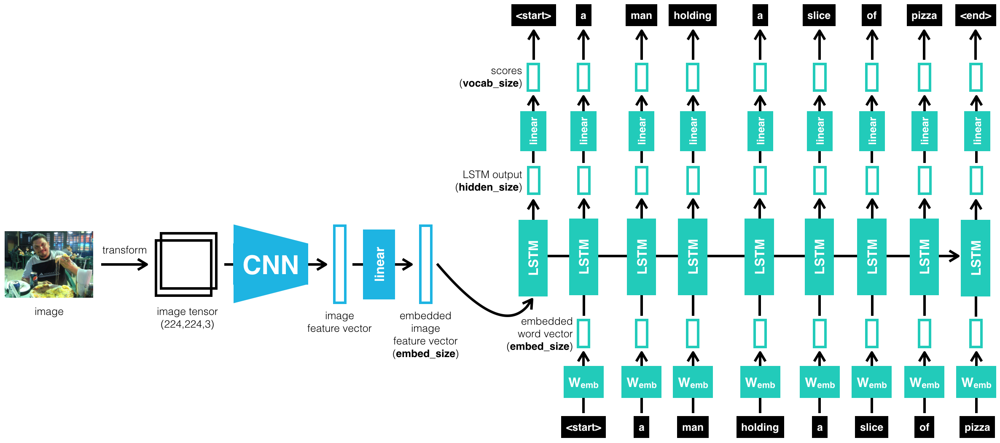

### Image Captioning

A link to the source code can be found here:
[P2_Image_Captioning](https://github.com/vnegreanu/UCCV/tree/master/02_Image_Captioning)

#### Description

In this project we combine Convolutional Neural Networks (CNN) and Recurrent Neural Networks (RNN) to build a deep learning model that produces captions given an input image.
CNN will transform an input image into a set of features, and an RNN convert those features into descriptive language.

#### Files
* `0_Dataset notebook`: Explore MS COCO dataset using COCO API
* `1_Preliminaries notebook`: Load and pre-process data from the MS COCO dataset and design the CNN-RNN model for automatically generating image captions
* `2_Training notebook`: Training of the CNN-RNN model
* `3_Inference notebook`: Using the previously trained model to generate captions for images in the test dataset.
* `data_loader.py` : Custom data loader for PyTorch combining the dataset and the sampler
* `vocabulary.py` : Vocabulary constructor built from the captions in the training dataset
* `model.py` : Actualy this is the CNN-RNN mathematical model 

#### CNN Encoder
The encoder is based on a Convolutional neural network that encodes an image into a compact representation.

The CNN-Encoder is a pretrained network model **ResNet** (Residual Network). This network help regarding to the vanishing and exploding gradient type of problems. 

#### RNN Decoder
The CNN encoder is followed by a recurrent neural network that generates a corresponding sentence.

The RNN-Decoder consists in a single LSTM layer with 100 embeddings and 512 hidden size followed by one fully-connected (linear) layer, this architecture was presented from the paper `Show and Tell: A Neural Image Caption Generator (2014)` https://arxiv.org/pdf/1411.4555.pdf 

## CNN-RNN model 
Now that we have our chosen architecture for the encoder and the decoder, we can look at the whole picture of
our image captioning system !

By merging the CNN encoder and the RNN decoder, we can get a model that can find patterns in images and then use that information to help generate a description of those images. The input image will be processed by a CNN and we will connect the output of the CNN to the input of the RNN which will allow us to generate descriptive text.

