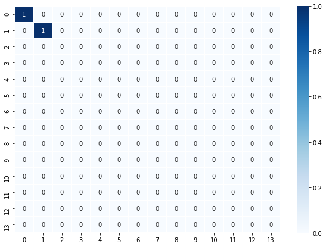
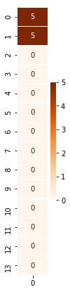
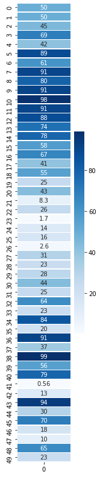

### Simultaneous Localization and Mapping (SLAM)

A link to the source code can be found here:
[P3_SLAM](https://github.com/vnegreanu/UCCV/tree/master/03_SLAM)

## Description

In this project, we implement SLAM (Simultaneous Localization and Mapping for a 2D world.
We combine robot sensor measurements and movement to create a map of an environment from only sensor and motion data gathered by a robot, over time.

SLAM gives us a way to track the location of a robot in the world in real-time and identify the locations of landmarks such as buildings, trees, rocks, and other world features.

Below is an example of a 2D robot world with landmarks (purple x's) and the robot (a red 'o') located and found using only sensor and motion data collected by that robot.

#### Files

- `Notebook 1` : Robot moving and sensing
- `Notebook 2` : Omega and Xi, Constraints
- `Notebook 3` : Landmark detection and tracking
- `robot_class.py` : Robot class with sense and move functions
- `helpers.py` : helper functions

#### Graph SLAM

To implement Graph SLAM, a matrix and a vector (omega and xi, respectively) are introduced.
The matrix is square and labelled with all the robot poses (xi) and all the landmarks (Li).

Every time we make an observation, for example as we move between two poses by some distance
`dx` and can relate those two positions, you can represent this as a numerical relationship in these matrices.

#### Implementation

After correctly implementing SLAM, we can visualize

- Omega :

- Xi :

#### Solution 
To "solve" for all these x values, we can use linear algebra; all the values of x are in the vector `mu` which can be calculated as a product of the inverse of omega times `xi`.

Notice that our initial position is `[x = world_size / 2, y = world_size / 2]` since we assume
with absolute confidence that our robot starts out in the middle of the defined world.

#### Visualization of the constructed world

Finally, we can visualize the code implemented : the final position of the robot and the position of landmarks, created from only motion and measurement data. 
We construct `dx` and `dy` based on `rand()` and measurment noise and we then compare the absolute values of `dx` or `dy` against the measurment range since `dx` and `dy` can be negative.

